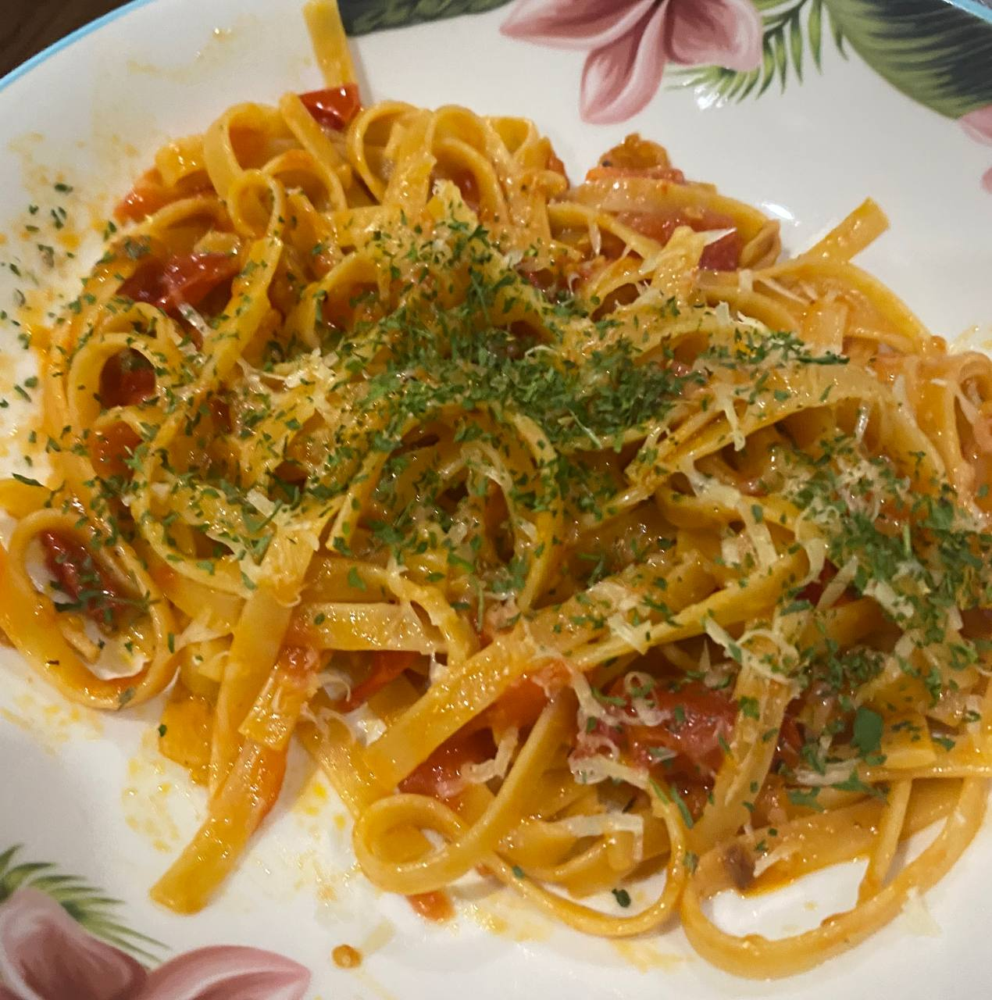

# Ingredients

- 8 cherry tomato / pax
- Garlic
- Choice of pasta
- Olive oil
- Condiments : Salt, pepper, brown sugar(or baking soda)

# Steps

1. Start boiling pasta
1. Stir-fry minced garlic in oil till slightly brown
1. Throw in sliced tomatoes
1. Mash tomatoes once soft
1. Add salt and pepper to taste, brown sugar to neutralise the acidity
1. Throw in al dente pasta with some pasta water to emulsify the sauce
1. Serve, garnise with grated cheese and parsley
